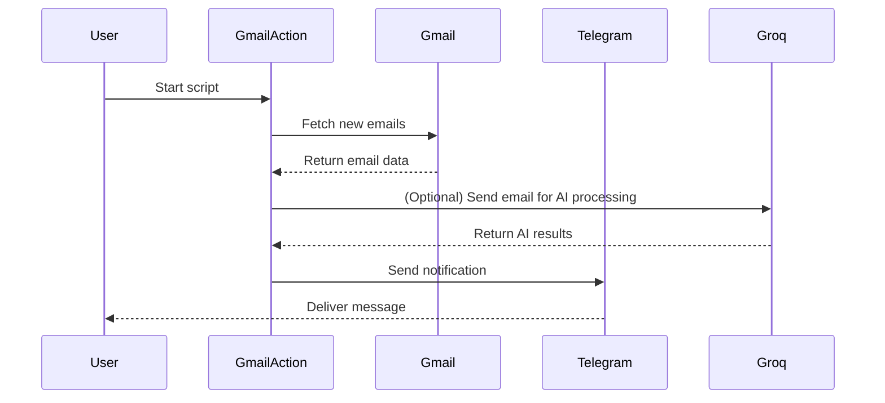

# 📧 Gmail-action

**Automate Gmail. Integrate notifications. Supercharge your inbox.**

Gmail-action is a Python toolkit for automating Gmail tasks, integrating with Telegram and Groq for advanced notifications and actions. Streamline email workflows, trigger bots, and connect Gmail to your favorite tools.

[](LICENSE)
[](https://www.python.org/)
[](https://github.com/user/Gmail-action/issues)
[](https://github.com/user/Gmail-action/commits)

---

## 📑 Table of Contents

- [Introduction](#-introduction)
- [Features](#-features)
- [Architecture](#-architecture)
- [Workflow](#-workflow)
- [Tech Stack](#-tech-stack)
- [Installation](#-installation)
- [Project Structure](#-project-structure)
- [Usage](#-usage)

---

## 🚀 Introduction

Managing Gmail at scale is challenging: from missing critical messages to connecting with chatbots or triggering workflows, manual processing is slow and error-prone. Gmail-action automates Gmail operations and seamlessly integrates with messaging and AI platforms.

**Who benefits?**
- Developers needing programmable Gmail automation
- Teams who want Telegram/Groq notifications for incoming mail
- Power users seeking to connect Gmail with custom bots

| Feature                 | Gmail-action | Zapier Gmail | IFTTT Gmail |
|-------------------------|:-----------:|:------------:|:-----------:|
| Open-source             | ✅          | ❌           | ❌          |
| Python extensibility    | ✅          | ❌           | ❌          |
| Telegram integration    | ✅          | ❌           | ❌          |
| Groq (AI) integration   | ✅          | ❌           | ❌          |
| Unlimited triggers      | ✅          | 🚫           | 🚫          |
| Free to use             | ✅          | 🚫           | 🚫          |

---

## ✨ Features

### Core Features
- 📩 Automate Gmail tasks: read, search, and process emails programmatically
- 🔔 Real-time Telegram notifications for custom Gmail events
- 🤖 Route emails to Groq for AI-powered processing or chatbots
- 🏷️ Custom action hooks: define what happens when you get an email

### Developer Experience
- 🧩 Simple Python API for quick integration
- 🛠️ Easy environment configuration with `.env` support
- 📦 Modular and extensible for custom logic

### Deployment
- 🚀 Ready for Docker or any Python environment
- 📜 MIT-licensed and production-ready
- ⚡ Minimal dependencies, fast startup

---

## 🏗️ Architecture

```mermaid
flowchart LR
    Client[User/Script]
    Gmail[Gmail API]
    Bot[bot.py (Core Logic)]
    Telegram[Telegram Bot API]
    Groq[Groq API]

    Client --> Bot
    Bot <---> Gmail
    Bot -- Notify --> Telegram
    Bot -- AI Actions --> Groq
```

| Component  | Role                                      | Technology             |
|------------|-------------------------------------------|------------------------|
| bot.py     | Core orchestration & logic                | Python, google-api     |
| Gmail API  | Access and manage emails                  | Google API             |
| Telegram   | Pushes notifications to users             | Telegram Bot API       |
| Groq       | AI-powered email processing               | Groq API               |
| .env       | Configures credentials and tokens         | dotenv                 |

---

## 🔄 Workflow



**Step-by-step Flow:**
1. User starts the Gmail-action bot/script.
2. Script authenticates and fetches emails from Gmail via the Google API.
3. (Optional) Email content is sent to Groq for AI processing or classification.
4. Script sends a notification to the configured Telegram chat with details or results.
5. User receives instant updates or actionable messages via Telegram.

---

## 🛠️ Tech Stack

| Layer         | Technology                | Purpose                                       |
|-------------- |--------------------------|-----------------------------------------------|
| Core Logic    | Python 3.8+              | Main application and orchestration            |
| Email Access  | Google API (gmail)       | Read/search Gmail, manage emails              |
| Notifications | Telegram Bot API         | Send chat notifications                       |
| AI Processing | Groq API                 | AI-powered email understanding/actions        |
| Config        | dotenv/.env              | Secure environment variable management        |

---

## ⚡ Installation

### Prerequisites

- Python 3.8+
- Google Cloud project with Gmail API enabled
- Telegram Bot credentials (token, chat ID)
- Groq API key (optional for AI features)

### Quick Start

```bash
git clone https://github.com/selvaganesh19/Gmail-action.git
cd Gmail-action
pip install -r requirements.txt
```

### Environment Setup

```bash
cp .env.example .env
# Fill in your Gmail, Telegram, and Groq credentials in .env
```

---

## 📂 Project Structure

```
Gmail-action/
├── bot.py               # Main application logic
├── requirements.txt     # Python dependencies
├── .env.example         # Example environment file
├── README.md            # Project documentation
├── LICENSE              # MIT License
└── ...
```

---

## 🚦 Usage

### Basic Example: Start the Bot

```python
# Start Gmail-action (ensure .env is configured)
python bot.py
```

### Advanced Example: Custom Action on Email

```python
from bot import process_email

def custom_handler(email):
    if "urgent" in email["subject"].lower():
        # Trigger custom logic, e.g., send to another service
        print("Urgent email received:", email["subject"])

process_email(callback=custom_handler)
```
<details>
<summary>What can you do?</summary>

- Receive instant Telegram alerts for important emails
- Auto-route emails to Groq for summarization, classification, or AI chat
- Build your own automations by modifying `bot.py` or plugging in custom functions

</details>

---

**Contributions, issues, and pull requests are welcome!**

Check the [issues](https://github.com/user/Gmail-action/issues) or [discussions](https://github.com/user/Gmail-action/discussions) for help and roadmap.

## License
This project is licensed under the **MIT** License.

---
🔗 GitHub Repo: https://github.com/selvaganesh19/Gmail-action