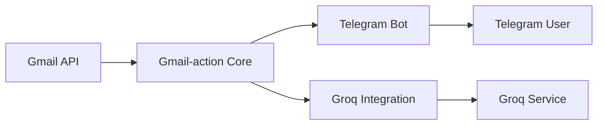
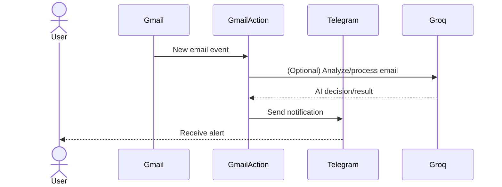

# 📧 Gmail-action

**Automate Gmail. Integrate notifications. Supercharge your inbox.**

Gmail-action is a Python toolkit for automating Gmail workflows, integrating with Telegram and Groq for real-time alerts and actions. Effortlessly streamline your email tasks, trigger powerful bots, and connect Gmail to your favorite platforms.

[](LICENSE)
[](https://www.python.org/)
[](https://github.com/youruser/Gmail-action/issues)
[](https://github.com/selvaganesh19/Gmail-action/stargazers)

---

## 📚 Table of Contents

- [Introduction](#introduction)
- [Features](#features)
- [Architecture](#architecture)
- [Workflow](#workflow)
- [Tech Stack](#tech-stack)
- [Installation](#installation)
- [Project Structure](#project-structure)
- [Usage](#usage)

---

## 🧐 Introduction

Managing a busy inbox and integrating Gmail with your favorite messaging and automation tools can be a real challenge. Gmail-action bridges the gap by enabling seamless Gmail automation, real-time notifications to Telegram, and integration with Groq for advanced processing.

**Who is this for?**
- Developers building custom email workflows
- Teams needing real-time alerts and actions on Gmail events
- Power users who want to connect Gmail with other services effortlessly

**Why Gmail-action?**

| Feature | Gmail-action | Alternative A (Zapier) | Alternative B (IFTTT) |
|--------------------------|:-----------:|:----------------------:|:---------------------:|
| Native Gmail API support | ✅ | ✅ | ❌ |
| Telegram integration | ✅ | ❌ | ✅ |
| Groq AI actions | ✅ | ❌ | ❌ |
| Self-hosted | ✅ | ❌ | ❌ |
| Python extensibility | ✅ | ❌ | ❌ |
| Open-source | ✅ | ❌ | ❌ |

---

## ✨ Features

### Core Features
- 📬 Automate Gmail tasks using the official Gmail API
- 🤖 Trigger custom bots on new emails or labels
- 🔔 Send real-time notifications to Telegram
- 🧠 Integrate with Groq for advanced AI-powered actions

### Developer Experience
- ⚡️ Simple Python interface for rapid prototyping
- 🛠️ Easily extend workflows with your own scripts
- 🧩 Modular components for custom pipelines

### Deployment
- 🚀 Ready-to-deploy with environment variable configuration
- 🐳 Docker-friendly for easy cloud and local deployment
- 🔒 Secure token management using environment variables

---

## 🏗️ Architecture



| Component | Role | Technology |
|---------------------|-----------------------------------------|--------------------|
| Gmail API | Email data source | Google Gmail API |
| Gmail-action Core | Workflow engine & event processing | Python |
| Telegram Bot | Notification delivery | Telegram API |
| Groq Integration | Advanced AI actions | Groq API |
| Telegram User | Receives alerts | Telegram |
| Groq Service | Processes advanced logic | Groq Cloud |

---

## 🔄 Workflow



**Step-by-step process:**

1. Gmail receives a new email, triggering an event.
2. Gmail-action fetches the email and, if configured, sends it to Groq for AI-based processing.
3. Groq returns its analysis or action decision.
4. Gmail-action sends a notification to your Telegram chat with details or results.
5. The user receives a real-time notification on Telegram.

---

## 🧰 Tech Stack

| Layer | Technology | Purpose |
|-------------- |-------------------|-----------------------------------|
| API Client | Google Gmail API | Email access and management |
| Bot Layer | Telegram Bot API | Notifications and actions |
| AI Services | Groq API | Advanced processing/automation |
| Core Engine | Python (3.8+) | Workflow orchestration |
| Auth | OAuth 2.0 | Secure authentication |
| Config | dotenv/env | Secure environment management |

---

## 🚀 Installation

### Prerequisites

- Python 3.8 or higher
- Gmail API credentials (OAuth 2.0)
- Telegram Bot token and chat ID
- (Optional) Groq API key

### Quick Start

```bash
git clone https://github.com/selvaganesh19/Gmail-action.git
cd Gmail-action
pip install -r requirements.txt
```

### Environment Setup

```bash
cp .env.example .env
# Fill in your Gmail, Telegram, and Groq credentials in .env
```

---

## 🗂️ Project Structure

```
Gmail-action/
    bot.py
    gmail_action/
        __init__.py
        gmail_client.py
        telegram_client.py
        groq_client.py
        workflow.py
    requirements.txt
    .env.example
    README.md
```

---

## 🛠️ Usage

### Basic Example: Send a Telegram notification on new Gmail

```python
from gmail_action import GmailWatcher, TelegramNotifier

watcher = GmailWatcher()
notifier = TelegramNotifier(token='YOUR_TELEGRAM_TOKEN', chat_id='YOUR_CHAT_ID')

for email in watcher.listen():
    notifier.send(
        f"New email from {email['from']}: {email['subject']}"
    )
```

### Advanced Example: Trigger Groq AI action and notify

```python
from gmail_action import GmailWatcher, TelegramNotifier, GroqClient

watcher = GmailWatcher()
notifier = TelegramNotifier(token='YOUR_TELEGRAM_TOKEN', chat_id='YOUR_CHAT_ID')
groq = GroqClient(api_key='YOUR_GROQ_API_KEY')

for email in watcher.listen():
    action = groq.analyze_email(email['body'])
    notifier.send(
        f"AI Action for email from {email['from']}: {action['result']}"
    )
```

---

**Gmail-action: Automate, notify, and power up your email workflow with Python.**


## License
This project is licensed under the **MIT** License.

---
🔗 GitHub Repo: https://github.com/selvaganesh19/Gmail-action